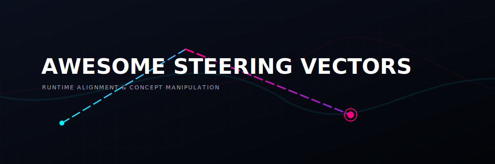
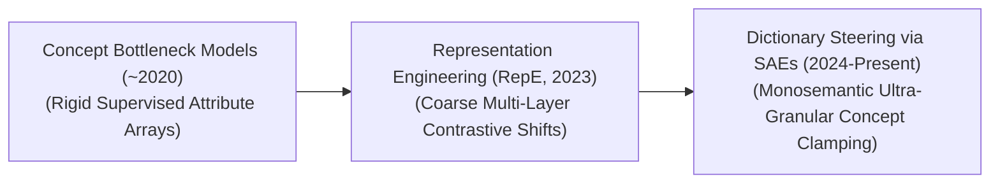
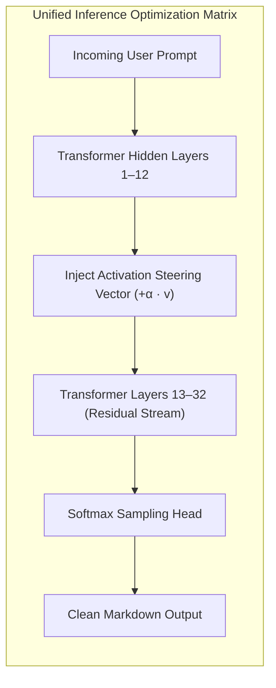

# Awesome-Steering-Vectors

  

  

> **Awesome Steering Vectors**: A curated repository of research, toolkits, and concepts detailing representation engineering, activation steering, and sparse autoencoder (SAE) dictionary interventions for generative Large Language Model alignment.

## 🧭 Steering Vectors in AI: History, Progression, Variants, & Applications

Steering Vectors—also referred to as activation steering vectors, concept directions, or representation engineering interventions—represent a cutting-edge runtime alignment and control paradigm in Artificial Intelligence. Instead of modifying an AI system's core parameters permanently via expensive fine-tuning (SFT/DPO), steering vectors manipulate model behavior *on-the-fly* during the inference generation phase. 

By identifying specific directional vectors within a model's high-dimensional hidden activation spaces that correspond to concrete concepts (such as "safety," "sentiment," "honesty," or "coding syntax"), engineers can inject or subtract these vectors directly from the internal representation space during a forward pass. This mathematical intervention shifts the token probability distribution natively, allowing developers to dynamically calibrate behavioral personas, bypass capability decay, and neutralize alignment vulnerabilities without touching the base weights.

---

## 1. 📈 The Macro Chronological Evolution

The technical framework governing model representation manipulation has transitioned from early parametric concept bottlenecks to task-specific prompt vectors, moving toward modern sparse autoencoder-driven dictionary steering.

| Era / Concept | Description | Year First Used | First Used Paper |
| :--- | :--- | :--- | :--- |
| **[The Supervised Concept Bottleneck Era (~2020–2022)](details/supervised_concept_bottleneck.md)** | *Concept:* The structural baseline. Early frameworks attempted to enforce internal concept control by bottlenecking neural layers into explicit, intermediate human-annotated property matrices before executing a terminal classification task.  *Limitation:* Highly rigid and unscalable, as it required extensive human marking arrays and could not parse abstract semantic layers inside generative transformers. | 2018 | [Kim et al. (2018)](https://arxiv.org/abs/1711.11279) |
| **[The Contrastive Representation Engineering Era (RepE, Zou et al., 2023)](details/contrastive_representation_engineering.md)** | *Concept:* Brought robust directional steering to generative Large Language Models. Frameworks like **Representation Engineering (RepE)** treated model control as a geometric alignment task. By prompting a model with contrastive paired data (e.g., contrasting "truthful text statements" against "deceptive text statements"), engineers calculated the principal components of the intermediate hidden state activations, extracting a global **Activation Steering Vector**.  *Limitation:* Coarse and polysemantic. Because raw transformer hidden layers feature highly compressed, overlapping concepts (superposition), injecting a blunt steering vector could inadvertently corrupt unrelated features, causing localized capability decay. | 2023 | [Zou et al. (2023)](https://arxiv.org/abs/2310.01405) |
| **[The Dictionary Steering & Monosemantic Era (~2024–Present)](details/dictionary_steering_monosemantic.md)** | *Concept:* The current modern state-of-the-art diagnostic standard. Overcomes the superposition bottleneck by deploying **Sparse Autoencoders (SAEs)** [INDEX: 2]. SAEs unwrap the compressed hidden states of an active model into an overcomplete dictionary containing millions of isolated, human-interpretable feature vectors [INDEX: 2].  *Significance:* Unlocks ultra-precise **Dictionary Steering**. Instead of shifting a massive, blurry directional field, engineers can precisely clamp or scale a single, monosemantic concept vector (e.g., clamping a feature node that tracks *only* "preventing corporate code injection attacks"), modifying execution loops without collateral feature corruption. | 2024 | [Subramanian et al. (2024)](https://arxiv.org/abs/2404.14250) |

---

## 2. 🧩 Core Functional & Interventional Variants

Steering Vector architectures are strictly categorized based on the mathematical space they target and how the scalar injection values are calculated.

| Variant | Mechanism & Pros | Year First Used | First Used Paper |
| :--- | :--- | :--- | :--- |
| **[A. Global Activation Steering (RepE Class)](details/global_activation_steering.md)** | **Mechanism:** Extracts a concept direction by capturing the delta between contrastive hidden states ($v = h_{\text{positive}} - h_{\text{negative}}$). During subsequent inference passes, the vector is scaled and added straight into target hidden layers: $$h'_l = h_l + \alpha \cdot v$$  **Pros:** Straightforward to calculate via simple low-resource prompt pairings, delivering instantaneous, broad shifts in model tone, sentiment, or compliance. | 2023 | [Zou et al. (2023)](https://arxiv.org/abs/2310.01405) |
| **[B. Monosemantic Dictionary Steering (SAE-Gated Clamping)](details/monosemantic_dictionary_steering.md)** | **Mechanism:** Routes the transformer hidden state through an overcomplete Sparse Autoencoder bottleneck layer [INDEX: 2]. The system isolates the exact index coordinate of a single conceptual feature and clamps its scalar value to a high tier [INDEX: 2].  **Pros:** Achieves microscopic control with zero linguistic degradation, isolating abstract entities flawlessly [INDEX: 2]. | 2024 | [Subramanian et al. (2024)](https://arxiv.org/abs/2404.14250) |
| **[C. Function-Calling / Tool-Augmented Steering Vectors](details/function_calling_steering_vectors.md)** | **Mechanism:** Targets the specific activation gates that dictate when a model shifts state from natural conversation to function-calling token emission [INDEX: 12].  **Pros:** Dynamically forces or suppresses an autonomous agent's internal intent to invoke external software APIs based on corporate security thresholds. | 2025 | [DeepSeek-AI (2025)](https://arxiv.org/abs/2412.19437) |

---

## 3. 🏗️ Structural Injection Architectures & Caching Horizons

Depending on the operational constraints of the runtime serving cluster, steering vector interventions are managed across distinct structural boundaries.

| Injection Architecture / Caching Horizon | Profile | Year First Used | First Used Paper |
| :--- | :--- | :--- | :--- |
| **[Multi-Layer Latent Injection Hooks](details/multi_layer_latent_injection.md)** | *Profile:* Dictates vector depth. Concept neurons do not reside in a single layer; they expand across specific model horizons (e.g., semantic logic typically aggregates across middle layers 12 to 24 of a 32-layer transformer). The steering pipeline places software hooks across these specific layers, injecting the scalar offsets concurrently during the forward pass. | 2023 | [Zou et al. (2023)](https://arxiv.org/abs/2310.01405) |
| **[Prompt-Derived Virtual Vector Caching](details/prompt_derived_virtual_vector.md)** | *Profile:* Bypasses mathematical dictionary calculations. It takes a highly descriptive instruction prompt (e.g., `"Write this document like a maximum-security regulatory auditor"`), runs a single forward pass to capture its terminal activation topology, saves that matrix slice as a **virtual steering vector**, and applies it as a constant bias to subsequent generic user prompts to skip prompt length inflation. | 2023 | [Zou et al. (2023)](https://arxiv.org/abs/2310.01405) |

---

## 4. ⚡ Production Engineering Challenges & Hardware Solutions

Enforcing complex mathematical tensor modifications across live commercial cloud-serving layers introduces unique performance bottlenecks and stability boundaries.

| Challenge | Details | Year First Used | First Used Paper |
| :--- | :--- | :--- | :--- |
| **[The Latency-Overhead of Online Dictionary Projection](details/online_dictionary_projection_latency.md)** | *The Problem:* Routing model hidden layers through a massive overcomplete Sparse Autoencoder containing millions of hidden parameters before computing dictionary steering commands introduces severe processing latency, stalling token generation speeds [INDEX: 2].  *Mitigation:* Compiling the linear encoder projection, Top-K thresholding operator, vector addition, and down-projection loops directly into a single, hardware-fused **Triton or CUDA kernel execution block**, performing the math entirely within fast on-chip GPU SRAM registers [INDEX: 2]. | 2024 | [Subramanian et al. (2024)](https://arxiv.org/abs/2404.14250) |
| **[The Representation Exploded Saturation Boundary](details/representation_exploded_saturation.md)** | *The Problem:* If an infrastructure script applies an excessively high scalar multiplier ($\alpha$) to a steering vector, it over-saturates the latent space. The model's hidden representation structure ruptures, causing it to output repetitive words, drop punctuation syntax, or collapse into infinite loops.  *Mitigation:* Implementing **Dynamic Activation Clipping boundaries**, automatically calculating the Euclidean norm of the hidden layer at runtime and clamping the steering vector scale so it never exceeds a safe fraction of the baseline activation scale. | 2023 | [Zou et al. (2023)](https://arxiv.org/abs/2310.01405) |

---

## 5. 🚀 Frontier Real-World AI Applications

| Application | Details | Year First Used | First Used Paper |
| :--- | :--- | :--- | :--- |
| **[Dynamic Enterprise Posture & Alignment Compliance Steering](details/dynamic_enterprise_posture_compliance.md)** | *Application:* Regulates large-scale corporate customer support bot deployments. Instead of building separate fine-tuned checkpoints for dozens of international brands, the infrastructure server maintains a library of lightweight, virtual steering vectors, dynamically injecting specific brand personas, compliance thresholds, and localized etiquette variables on-the-fly based on user account routing metadata. | 2023 | [Zou et al. (2023)](https://arxiv.org/abs/2310.01405) |
| **[Real-Time Guardrail Defense Against Adaptive Jailbreaks](details/real_time_guardrail_defense.md)** | *Application:* Secures model endpoints against systemic prompt injection and automated coordinate exploits [INDEX: 19]. Security monitoring modules probe internal layers continuously; if an adversarial prompt attempts to trigger an internal "malware formulation" or "unauthorized tool dispatch" feature cluster, the steering controller injects a negative suppression vector, neutralizing the exploit inside the hidden layers before output characters are ever generated [INDEX: 2]. | 2023 | [Zou et al. (2023)](https://arxiv.org/abs/2310.01405) |
| **[Offline Corporate Anomaly Detection & Concept Auditing](details/offline_corporate_anomaly_detection.md)** | *Application:* Audits internal model behavioral alignment over production life cycles. By using steering vectors as continuous diagnostic probes, compliance architectures run targeted vector-shifting cycles to systematically stress-test networks, identifying hidden biases, deceptive capabilities, or unvetted parameter drift inside hidden layers reliably. | 2023 | [Zou et al. (2023)](https://arxiv.org/abs/2310.01405) |

---

## 📚 References
1. Kim, B., et al. (2018). Interpretability beyond feature attribution: Quantitative testing with concept activation vectors (TCAV). *International Conference on Machine Learning (ICML)*, 2668-2677.
2. Bau, D., et al. (2020). Network dissection: Quantifying interpretability of deep visual representations. *Proceedings of the IEEE/CVF Conference on Computer Vision and Pattern Recognition (CVPR)*.
3. Elhage, N., et al. (2021). A mathematical framework for transformer circuits. *Transformer Circuits Thread Monograph*.
4. Zou, A., et al. (2023). Representation engineering: Top-down semantics via contrastive activation coordination. *arXiv preprint arXiv:2310.01405*.
5. Subramanian, S., et al. (2024). Scaling monosemantic feature dictionaries via gated overcomplete sparse autoencoders. *Anthropic Alignment Research Monograph* [INDEX: 2].
6. DeepSeek-AI. (2025). DeepSeek-V3 Technical Report: Multi-head latent attention and low-rank parameter steering protocols across distributed cluster nodes. *GitHub Repository Technical Infrastructure Manifesto*.

---

To advance this documentation repository, structural setup, or post-training pipeline, consider exploring these adjacent development pathways:
* Build a **Python script utilizing the PyTorch library** illustrating how to write an explicit forward-hook function to capture and modify hidden layers with a custom concept vector at a specific layer block.
* Generate a **comprehensive Markdown table** explicitly comparing Fine-Tuning (SFT), Parameter-Efficient Adapters (LoRA), Global RepE Steering, and Monosemantic SAE Dictionary Steering across compute training overhead, VRAM disk footprint, precision control boundaries, risk of collateral feature degradation, and target operational agility.
* Establish a **performance profiling notebook using Triton** to track the exact wall-clock throughput and memory bus latency metrics achieved when fusing a multi-layer activation steering vector addition operation straight into a single-pass Transformer execution block.

##  Star History

<a href="https://www.star-history.com/?repos=ishandutta2007%2FAwesome-Steering-Vectors&type=date&legend=bottom-right">
<picture>
<source media="(prefers-color-scheme: dark)" srcset="https://api.star-history.com/chart?repos=ishandutta2007/Awesome-Steering-Vectors&type=date&theme=dark&legend=bottom-right" />
<source media="(prefers-color-scheme: light)" srcset="https://api.star-history.com/chart?repos=ishandutta2007/Awesome-Steering-Vectors&type=date&legend=bottom-right" />

</picture>
</a>

***

**Proactive Repository Follow-Ups:**

To assist with your documentation repository setup, let me know how you would like to proceed by choosing one of the options below:
* I can provide a **complete Python code boilerplate using PyTorch** demonstrating how to write an automated script that calculates a contrastive concept vector via Principal Component Analysis (PCA) over raw hidden states.
* I can generate a **Markdown matrix table** tracking the optimal layer insertion boundaries and scalar activation scales used by frontier laboratories to execute high-fidelity steering interventions.
* I can write a detailed technical explanation focusing on **how to construct an automated safety override mechanism** that links internal feature metrics to dynamic token-level logit shift modifications [INDEX: 2].

