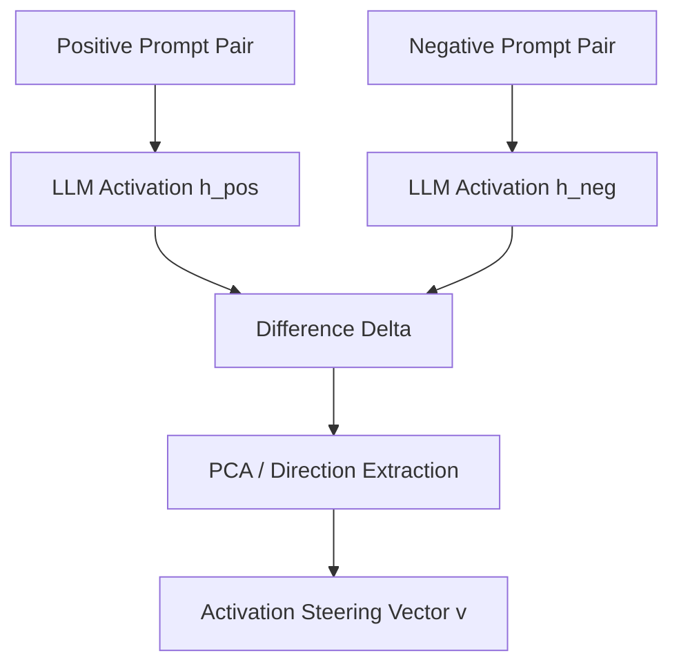

# Contrastive Representation Engineering Era (RepE)

Representation Engineering (RepE) treats model control as a geometric alignment task. By contrastive prompting, it extracts concept directions from the model's activation space during inference.

## Mechanism

By presenting positive and negative prompt pairs (e.g., honest vs. dishonest), we record the hidden activations and extract the principal direction of change.

## Advantages
- Training-free concept extraction.
- High efficacy for broad shifts in model tone and safety posture.

## Limitations
- Coarse and polysemantic (may affect unrelated features due to feature superposition).
