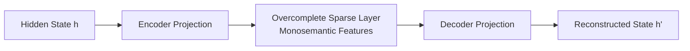

# Dictionary Steering & Monosemantic Era (~2024–Present)

The Dictionary Steering and Monosemantic Era leverages Sparse Autoencoders (SAEs) to untangle the polysemantic representations of LLM hidden layers, resolving superposition and enabling precise steering of individual features.

## Mechanism

A Sparse Autoencoder projects the compressed hidden states into a much larger, sparse dictionary layer where features are isolated and monosemantic.

## Advantages
- Monosemantic precision (scales and targets specific, isolated features).
- Minimal collateral feature degradation.

## Limitations
- High compute overhead for training and executing online dictionary projections.
