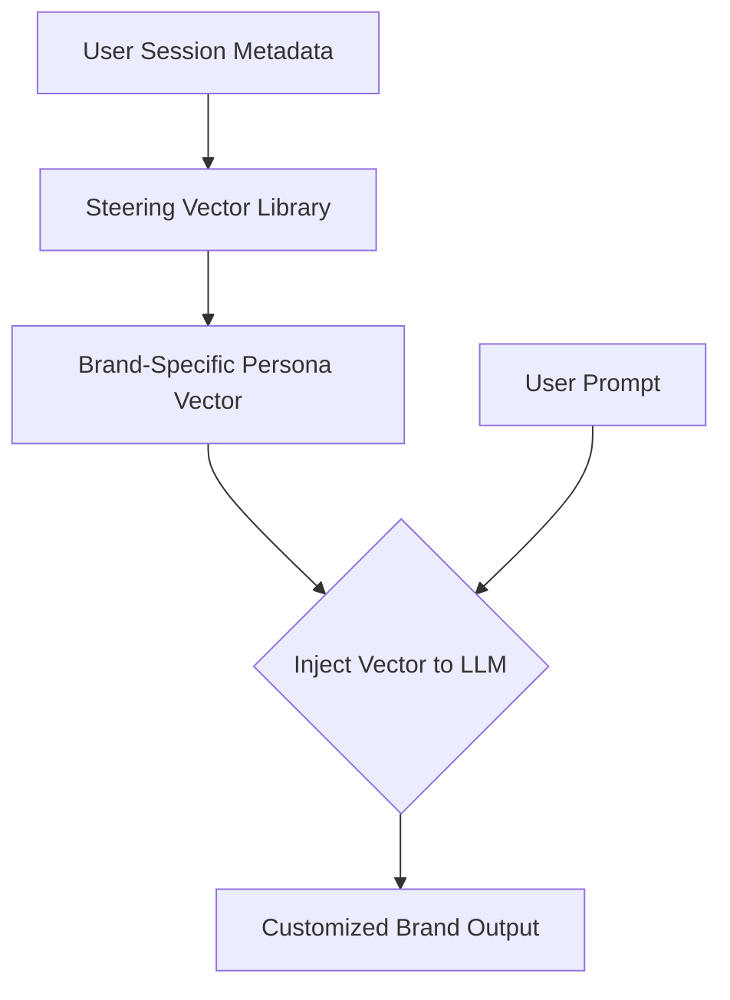

# Dynamic Enterprise Posture & Alignment Compliance Steering

Enables corporate bot systems to adjust their persona, regulatory alignment, and formatting rules dynamically without maintaining multiple base fine-tunes.

## Mechanism

Metadata from the user session triggers the insertion of brand-specific steering vectors into the forward pass.

## Advantages
- Saves VRAM by keeping a single shared base model.
- Dynamic, real-time persona updates.
