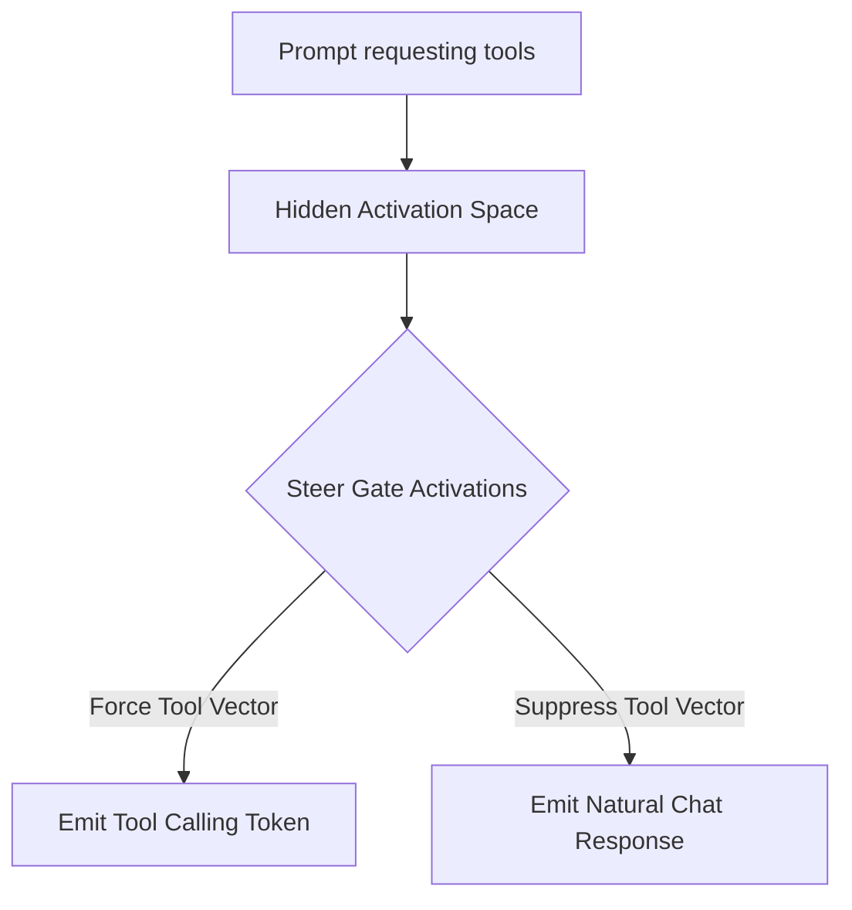

# Function-Calling / Tool-Augmented Steering Vectors

Targets the internal activation boundaries or gates that govern when an LLM shifts from natural text output to function-calling syntax.

## Mechanism

By identifying the activation signature of tool calls, engineers can inject positive vectors to force API execution or negative vectors to prevent tool calls.

## Advantages
- Dynamically enforces API permissions at inference time.
- Enhances security and stability in autonomous agent applications.
