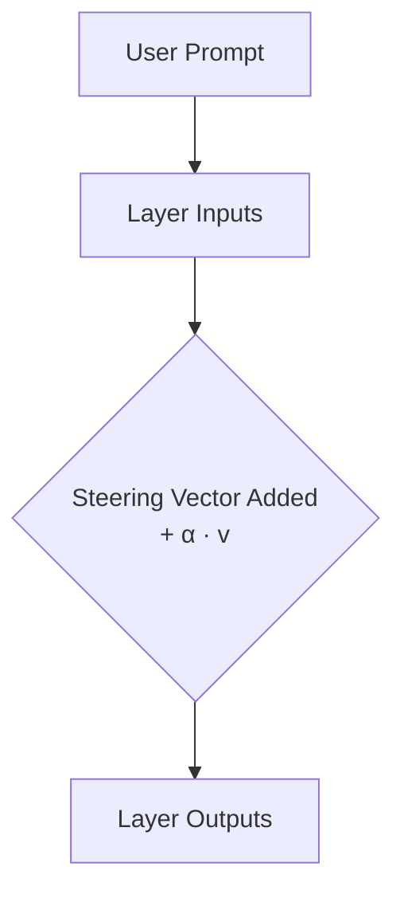

# Global Activation Steering (RepE Class)

Global Activation Steering modifies a model's latent representation streams globally during a forward pass. The steering offset is computed as a directional delta vector and added directly to the hidden state.

## Mathematical Formulation

$$h'_l = h_l + \alpha \cdot v$$

Where:
- $h_l$ is the hidden representation at layer $l$.
- $v$ is the steering vector.
- $\alpha$ is the scaling multiplier.

## Advantages
- Easy implementation and low overhead.
- Broad shifts in alignment, tone, and formatting style.
