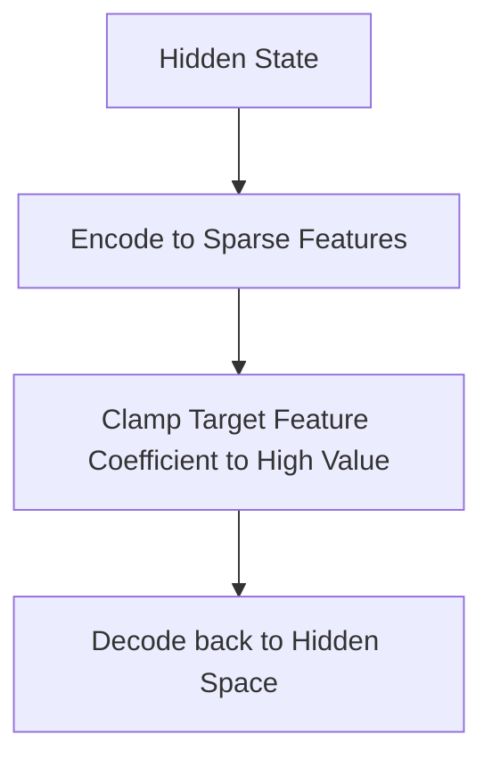

# Monosemantic Dictionary Steering (SAE-Gated Clamping)

Monosemantic Dictionary Steering routes hidden states through a Sparse Autoencoder (SAE) bottleneck, isolating exact features to clamp or scale.

## Mechanism

Instead of shifting the entire representation space, the encoder isolates the target feature coefficient and clamps its activation.

## Advantages
- Extremely fine-grained concept clamping.
- Zero linguistic or capability degradation in non-target behaviors.
