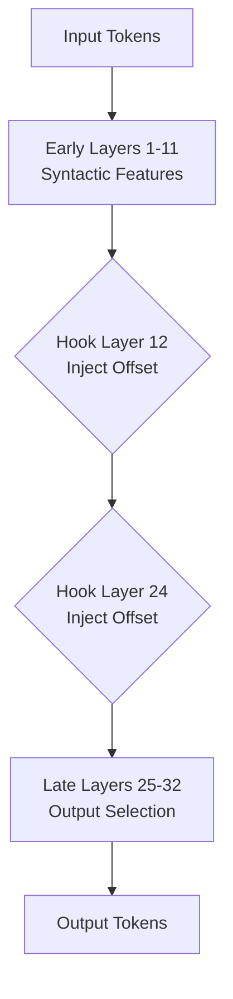

# Multi-Layer Latent Injection Hooks

Dictates the depth and boundaries of activation steering. Rather than injecting steering values into a single layer, this technique places hooks across target model horizons (typically middle layers).

## Mechanism

Interventions are performed dynamically across layers where abstract concepts are synthesized.

## Advantages
- Better alignment fidelity without disrupting early parser stages.
- Ensures stable concept representation updates.
