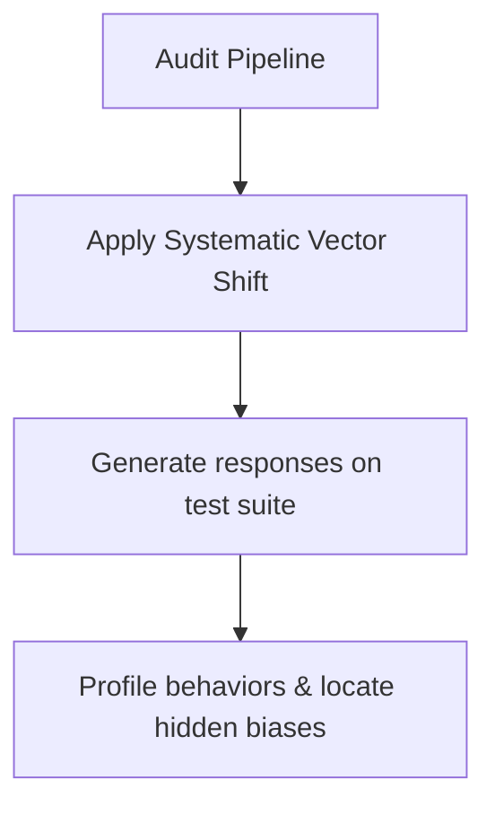

# Offline Corporate Anomaly Detection & Concept Auditing

Uses steering vectors as diagnostic probes during offline life cycles to audit alignment, uncover hidden biases, and track concept drift inside model weights.

## Mechanism

By shifting activations along specific vectors, compliance pipelines inspect response profiles to catalog dormant behaviors or capabilities.

## Advantages
- Proactive bias tracking.
- Quantifiable safety metrics.
