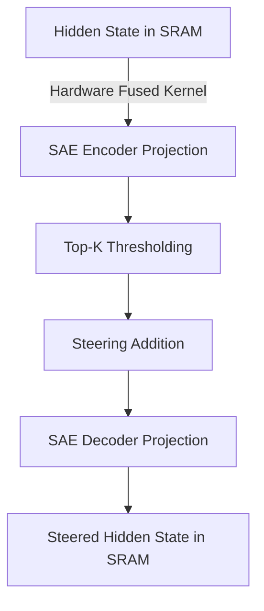

# The Latency-Overhead of Online Dictionary Projection

Routing intermediate states through massive Sparse Autoencoders adds substantial projection time. This challenge requires hardware-fused execution blocks to run projection steps in SRAM memory.

## Mechanism

Triton and CUDA kernels fuse encoder projection, thresholding, and addition directly into a single GPU block to avoid DRAM traffic.

## Mitigation
- Direct SRAM fusion using Triton/CUDA.
- Reduced precision float operations.
