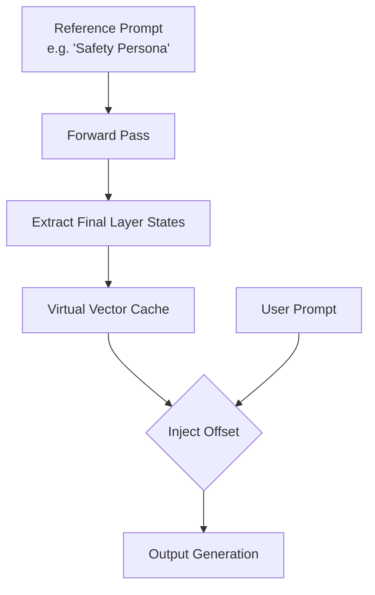

# Prompt-Derived Virtual Vector Caching

Bypasses heavy dictionary autoencoder calculations by caching activation states produced by descriptive instruction prompts and applying them as offsets to future context runs.

## Mechanism

Instead of encoding or computing concept matrices on the fly, a reference prompt (e.g. system instructions) is pre-run, and its output state offset is cached.

## Advantages
- Bypasses token length inflation.
- Negates the cost of parsing long system instructions repeatedly.
