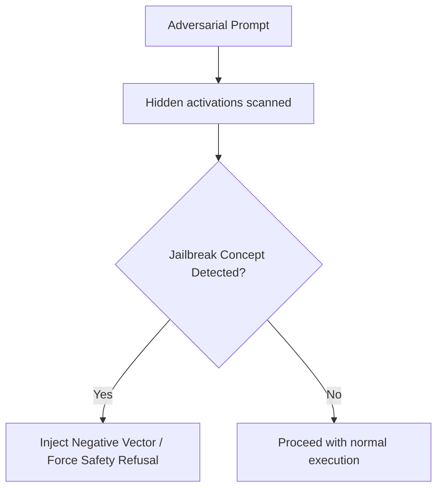

# Real-Time Guardrail Defense Against Adaptive Jailbreaks

Secures model endpoints against jailbreaks, adversarial prompting, and prompt injections by dynamically scanning activations and applying safety override adjustments.

## Mechanism

If an adversarial trigger is detected in intermediate states, a safety vector is injected to force model refusal or safe formatting.

## Advantages
- Resilient to adaptive formatting exploits.
- Intervenes before the token logits are sampled.
