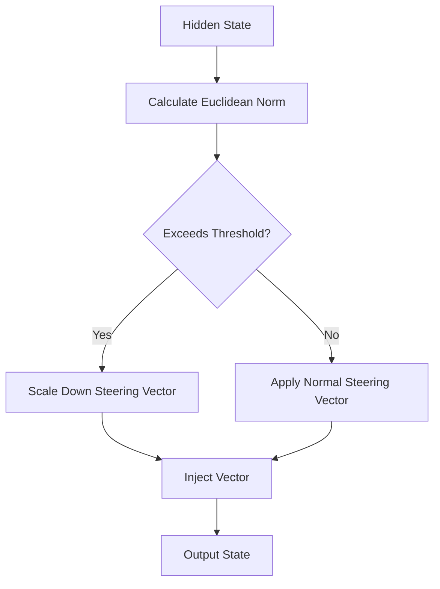

# The Representation Exploded Saturation Boundary

If the steering scale multiplier ($\alpha$) is set too high, the hidden representations deform, leading to repetition, loss of syntax, or model collapse.

## Mechanism

Dynamic Activation Clipping monitors the Euclidean norm of activations at runtime, dynamically scaling down the steering vectors if they exceed safe thresholds.

## Mitigation
- Dynamic norm scaling.
- Layer-wise proportional boundaries.
