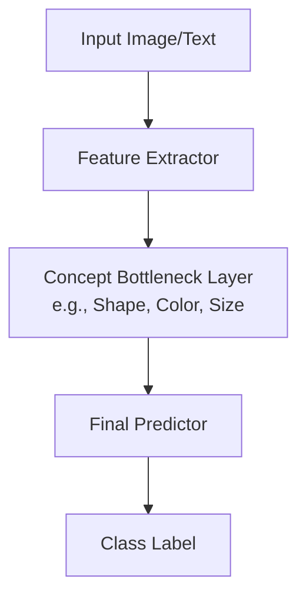

# Supervised Concept Bottleneck Era (~2020–2022)

The Supervised Concept Bottleneck era represented an early structural approach to enforcing human-interpretable concepts within neural networks. Instead of predicting the final task directly from raw features, models were forced to predict intermediate, human-annotated concept states first.

## Mechanism

Concept Bottleneck Models (CBMs) pass the input through a feature extractor to predict a set of predefined concept activations, which are then used by a final predictor.

## Advantages
- High interpretability (you know exactly which concepts led to the final prediction).
- Ability to intervene directly by editing concept activations at runtime.

## Limitations
- High annotation cost (requires labels for all concepts).
- Rigid and unscalable for complex generative spaces.
